# [Dog Walker](https://svgin.github.io/dog_walker/)

Dog Walker is a site which is created for dog walking and other dog care services (dog sitting, puppy care and similar) providing business. This businnes is located in Bourne Lincolshire and provides its profesional services in Bourn and sorounding areas. Dog Walker site is usefull for the business as it atracts more clients and it is usefull for dog owners as they can see the services provided and contact the bussines if they need more information or can sign up directly from the web page to save valuable time.

## Features

- ### Navigation Bar and Logo
  - Navigation Bar and Logo is displayd on all three pages. Both are locates on the top of the page and are always visible even when scrolling down.
  - Navigation Bar includes link to Logo, Home Page, Gallery and Sign Up pages.
  - Navigation Bar and Logo are identical on all three pages to allow for ease of navigation.
  - This section allows users easity navigate from page to page on all devices.
  
  
- ### Mobile and tablet friendly

  - Dog Walker Web page been made mobile phone and other device friendly, so more people can access the web page and have good experience while exploring it.
  
- ### The landing page image
  - The landing image has an eye catching image of the dog on the walk. It is and introduction to the Dog Walkers web page.
  - The landing image contains text overlay which gives information about the area where services are provided.

- ### About Us and Reasons to hire us section
    - About Us gives information about the business, the staff and the premises.
    - Reasons to hire us should encourage potential custumers to consider to use Dog Walkers services.
  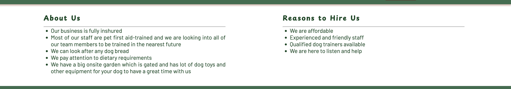

- ### Services and Prices secttion
  - This section gives a list of services the business provides and the prices for them. The section contains just neccesarry information and doesn't overcrowd the screen.
  - This section has the picture to attract the user to the service and prices section.
  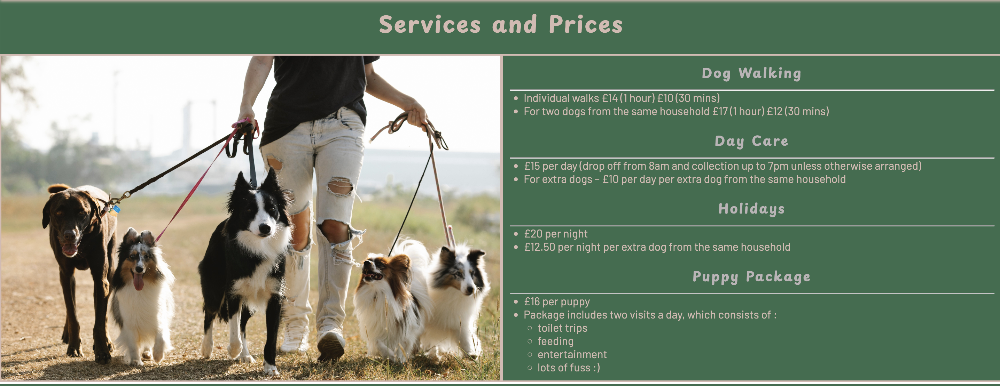

- ### Our Contacts Section
  - This section provides the different the user can contact the business.
  - Section incudes email address, Phone number, Facebook messenger and Adress. New contact options can be added and it will automaticaly adjust to the different screen sizes.
  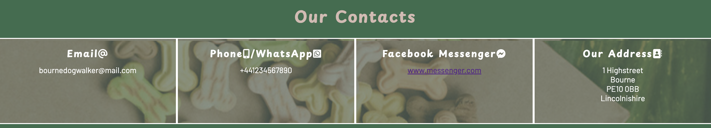
  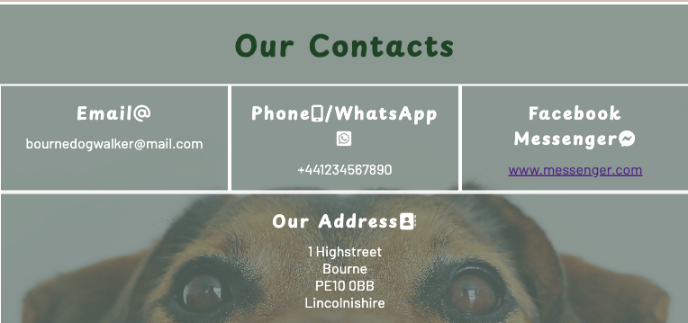

- ### The Footer
  - The footer section includes links to the relevant social media sites for Dog Walker. The links will open to a new tab to allow easy navigation for the user.
  - The footer is valuable to the user as it encourages them to keep connected via social media

- ### Gallery
  - Gallery is there to provide a visual information.
  - This section is valuable for users as they can see that their pets will have a good care. 
  

- ### The Sign Up Page
  - This page is mede for the user to be able to sign their pets up for dog walker services. The usre will need to share their full name, email address and phone number. User will need to describe their dog and ttell about potential issues or concerns about their dog. 
  

- ### Features left to implement
  - #### About us page       
    - Would like to add separate About us page, where could share more information about the business goals, ideas, vision and values.
    - Would includ testimonials and reewievs from wxisting custumers.
  - ### Extra links 
    - #### Email me
      - Will add to the the footer for the link directly opee emails ready for the user to type and send it.
    -  #### Local charity
       -  Add extra secttion at the bottom af the Home page with links to local charities and shelter that Dag Walker business supports.
    - #### Introducttion Video
      - Add video at Home page where business ownner and staff would describe their day to day work and experiences.

## Testing
- ### Navigation bar and logo
    Testing on different screen sizes to make sure the navigation bar and logo is visible, easy to use and spaced up correctly and to meke sure it is always located on the top of the screen. On mobile phones and all screens width smaller then 768px the nav bar is hidden in "burger" icon, so it doesnt take up too much space on the screen. When pressed on the nav bar is revieled. 

    On whider screens Navigation bar is fully wisible and located inline with the Logo.
    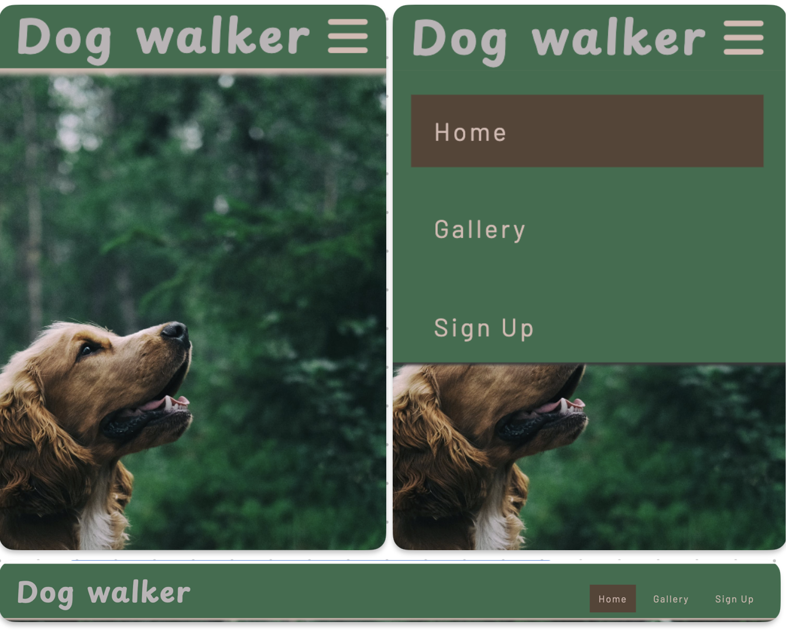

- ### The landing page image and text
  Tsting rhat the page and the text is responsive and looks good on any screen types, so the picture is visible and the text is located in the right place depending on the screen size.
  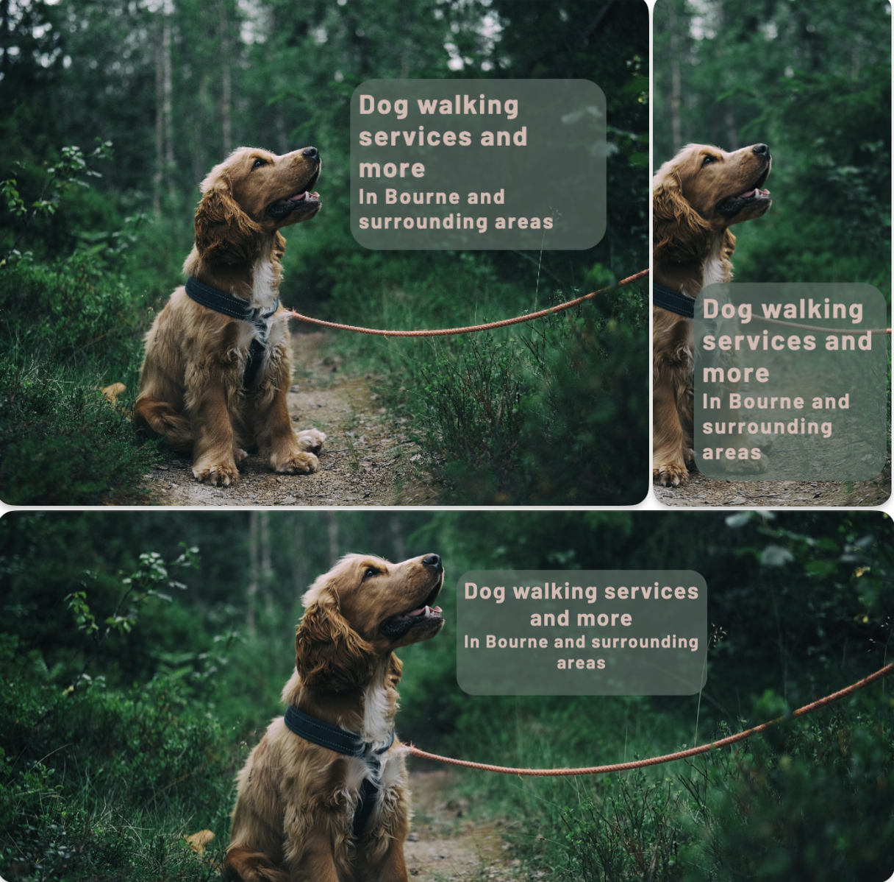

- ### Abaut Us/Reasons to hire us and Services/Prices sections
    Testing responsivnes of thise sections on different screen sizes to make sure both sections look good and readable and all information and pictture sisplayed in corect order and place on all devices.
    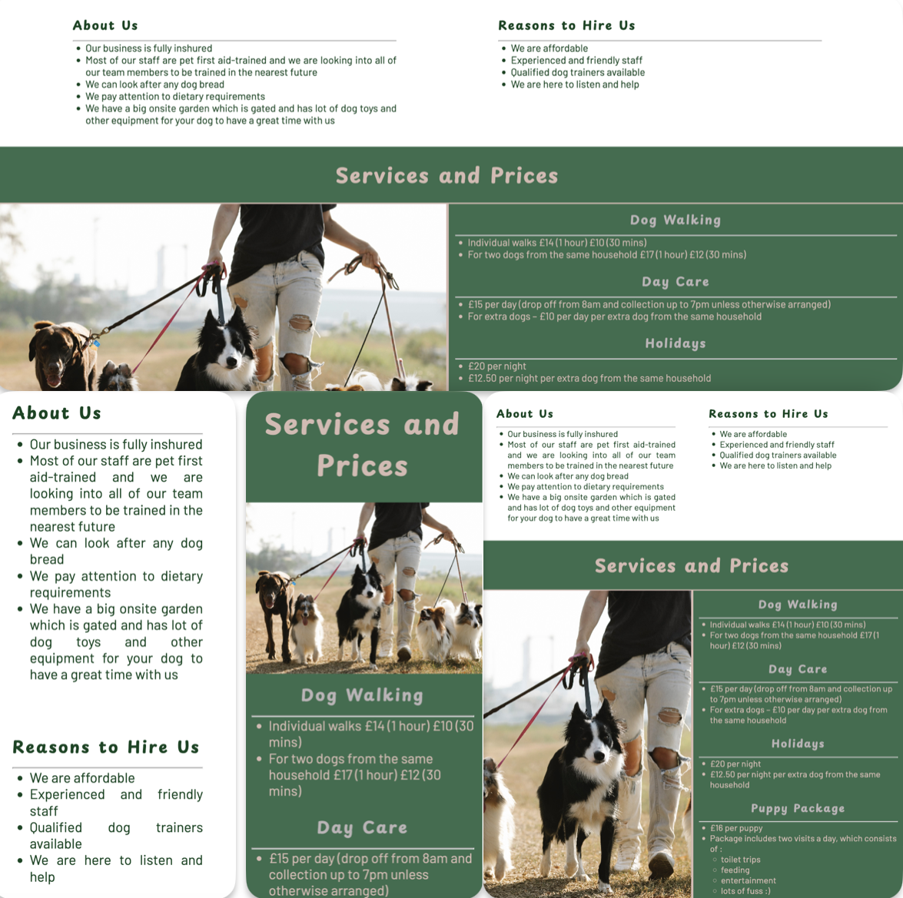
    
- ### Contact us section
  Testing responsivnes on all the screen sizes to make sure all the details are visible and look good and readable on the screen.
  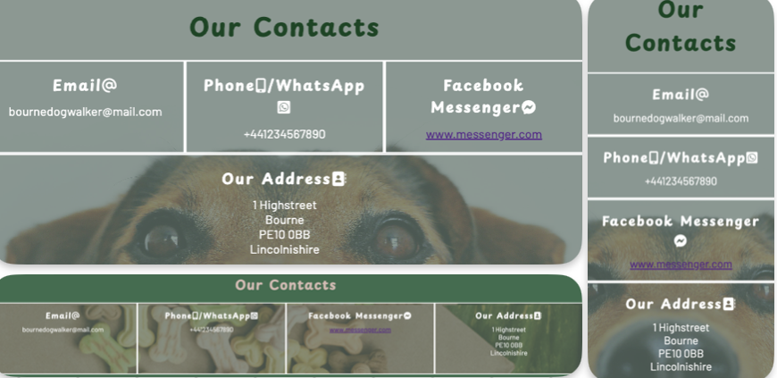

- ### Footer link testing 
  Tested all the links on all devise sizes to make sure all of them are opening on the saparate page on all screen sizes.
  
- ### Gallery
  Testing Gallery page, to make sure it is responsive to all devises, that all pictueres are visible and easy to see on different screen sizes.
   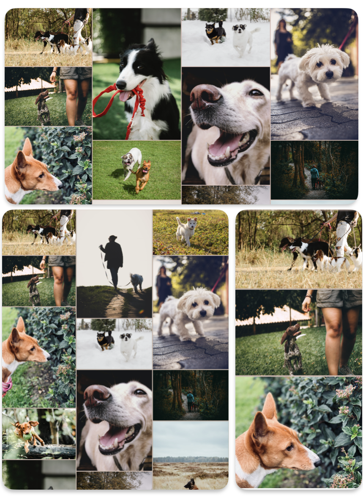
   
- ### Sign Up page and form
  - Testing the responsivnes of the form on different devise screens.
  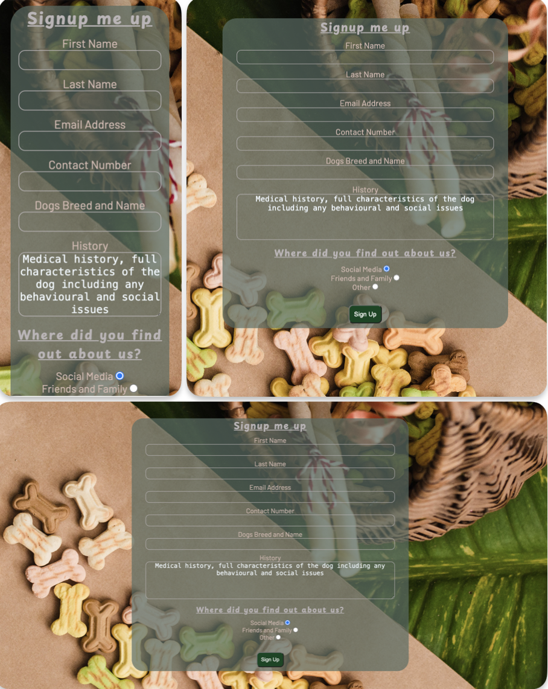
  
- ### Requaried fields
   - Making sure that the user is not able to submit form without providing neccesary information.
  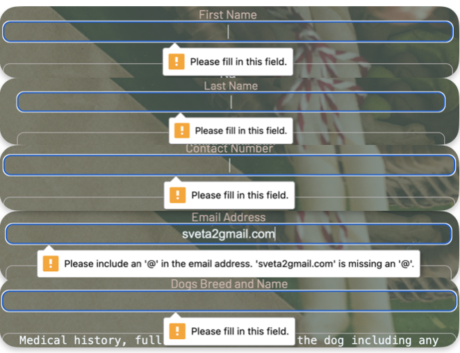
  
  - Testing if the form will populate information after submittion.
  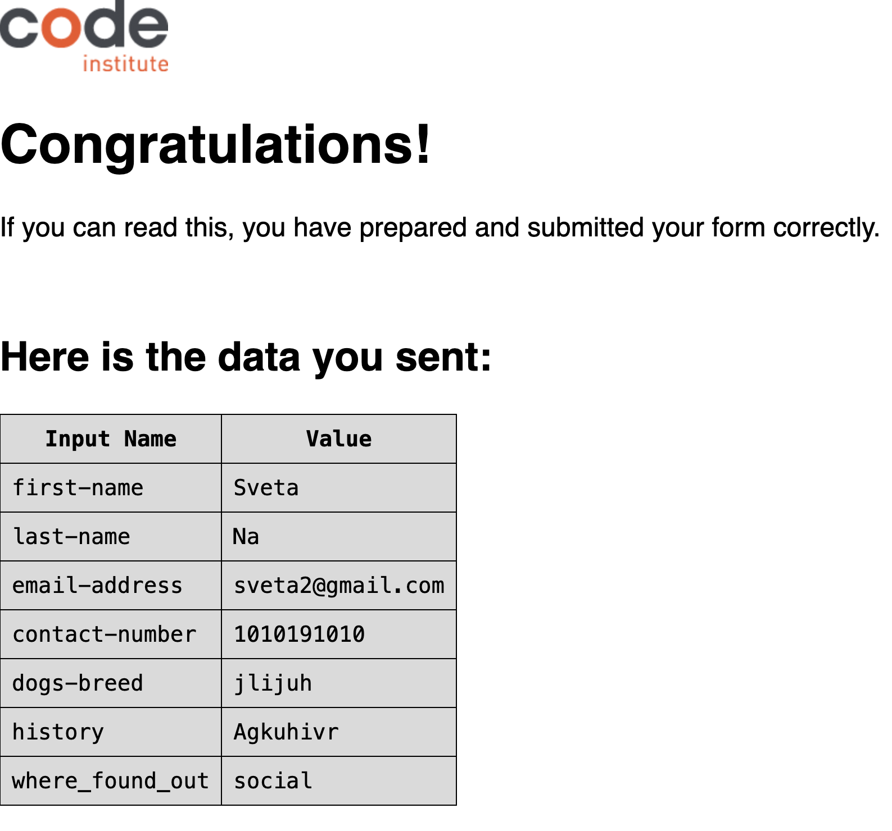
  